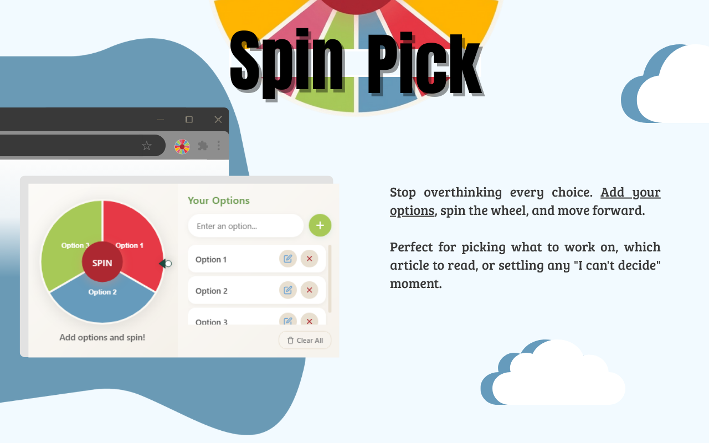
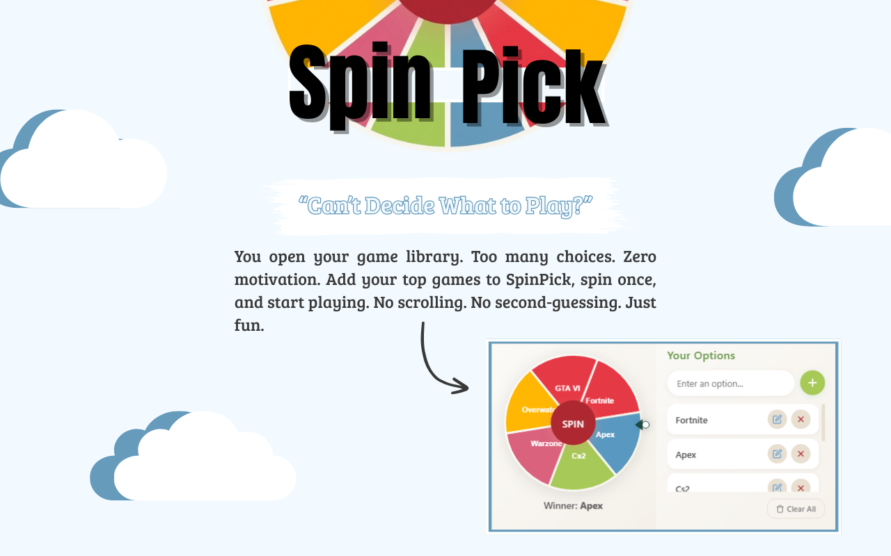

# SpinPick - Lucky Wheel Chooser

Can't decide? Let the wheel choose for you.

<p align="center">
  <a href="#">
    
  </a>
  <a href="LICENSE">
    
  </a>
</p>

## Screenshots

<p align="center">
  
  
</p>

## What it does

Add your options, spin the wheel, watch it pick one for you. That's it.

No more staring at your Steam library for 30 minutes. No more "what should I work on first?" paralysis. Just type in your choices and let the wheel decide.

## Why this exists

I kept opening my game library, scrolling for 20 minutes, then closing it without playing anything. Same thing with tasks - too many options, zero action.

Sometimes you just need something to make the choice for you. SpinPick does exactly that.

## Install

**From Chrome Web Store:** [Install SpinPick](https://chromewebstore.google.com/detail/spinpick-lucky-wheel-choo/jegkkmdeodigdlkigpeobbjmegpigoof?authuser=0&hl=pt-PT)

**From source:**
```bash
git clone https://github.com/Dpinto9/SpinPick-Lucky-Wheel-Chooser.git
```
Then go to `chrome://extensions/`, enable Developer mode, and load the folder.

## How to use

1. Click the SpinPick icon in your browser
2. Type in your options (games, tasks, videos, whatever)
3. Hit the spin button
4. Watch the wheel land on your answer
5. Actually do the thing instead of overthinking it

## Perfect for

- Choosing which game to play from your massive backlog
- Picking which task to tackle from your to-do list  
- Deciding what to watch next
- Breaking team decision deadlocks
- Any "I can't choose" moment

## How it works

You add options, the extension creates a wheel with equal sections for each choice, applies some physics to make it feel natural when spinning, and randomly selects one.

All the magic happens in your browser. Nothing gets sent anywhere.

## Privacy

- Zero data collection
- Everything stays on your device
- No tracking, no analytics
- No external connections

Open source so you can verify this yourself.

## Contributing

Found a bug? Want to add features? PRs welcome.

The code is straightforward JavaScript. No build process, no frameworks. Just open it and start coding.

## License

MIT - do whatever you want with it.

## Issues

Something broken? [Open an issue](https://github.com/Dpinto9/SpinPick/issues) and I'll check it out.

---

<p align="center">Made for people who have too many choices and not enough decisions</p>
